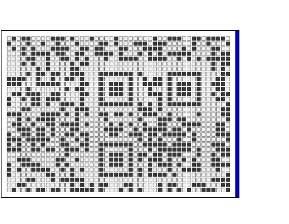

# Challenge 1 - Mic Check
- Solved by: @Elma, @BaeSenseii
- Flag: hli{hi!GLHF@HLI}

## Screenshot of Challenge

## Writeup
When visiting the website, we were presented with this weird-looking data that we can somehow resize by dragging the bar to the right:

After randomly resizing the pixels back and forth, we somehow managed to see what appears to be a QR code (which was corrupted as we were unable to scan it):

So this can be easily fixed by using Google to find QR code fix website to suggest how it can be fixed. After much trial and error, we managed to get this QR code up (in which we eventually got the flag):

