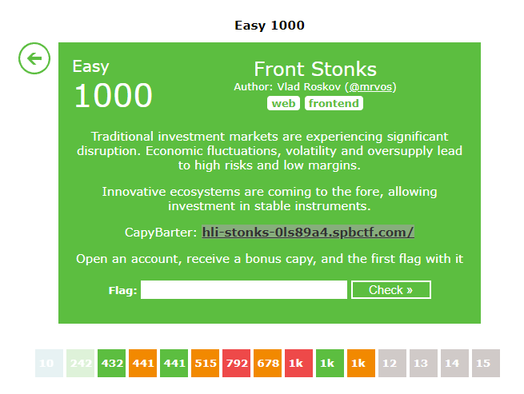

# Challenge 10 - FrontStonks
- Solved by: @Elma, @BaeSenseii
- Flag: hli{i_ExpECT_TO_BEcome_4_CaPYLl1onN4IrE}

## Screenshot of Challenge

## Writeup
This is proably gonna be a short write-up because it is really TOO easy as it just involves just a simple task of registering for an account.

Under the “How much are you planning to earn on stocks?” portion of the registration, it does not allow values above 0. And if we put 0, we cannot proceed with the registration.

However, there was no HTTP request being sent to the server when entering the value, so we can assume that there's some form of client-side input validation in place. If we look closely at the input field using the Browser Debugger tool, the field is set to the configuration of 'max="0", in which we can easily remove it:

Once removed you can proceed to key in ANY value:

Once done, log into the system with your new account and go to your Profile > Claims to get your flag (it was blurred out, but you can just click on it to see your flag.)

