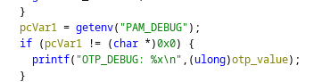

# Challenge 12 - Ten Time Password
- Solved by: @Elma, @BaeSenseii
- Flag: hli{TEN_t1me_PAssW0rd_IS_Ten_TIMes_B3ttER_THAN_oN3_TIM3_oNE}

## Screenshot of Challenge


## Writeup
Players are to gain access to the ‘getflag’ user account which has been implemented with some sort of 2FA OTP authentication.


Personaly i have not seen such authentication mechanisms before, so we suspected that it's a custom authenticaton library. We found the name of the library file inside the /etc/pam.d/su file:


Searching it wasn't difficult as you can use the find command:

```
find / -name pam_secureotp.so
```

In this case, we extracted out the pam_secureotp.so file from the system and went through Ghidra in this case to do further analysis. Under the list of functions, the ‘pam_sm_authenticate’ function seem to look quite interesting in this case.


The decompiled code shows the OTP process, but apparently if we set the “PAM_DEBUG” environment variable within the terminal to any value, the previous OTP value (in hex format) will be displayed before prompting the user to enter a new one.




Further renaming was done and we roughly can deduce the following information:
1. A random seed is generated and is calculated with modulo 10^8
2. User inputs the OTP value when prompted.
3. If it is correct, ‘su’ operation is successful.
4. If not, a new random seed will be generated with this mathematical equation = random_seed * 0x343fd + 0x269ec3
5. Repeat step 1 and 2 again until 3 is achieved (but there is a limit of 10 attempts)


Since we do have the logic and past OTP values, it is to no surprise that we need to do some form of mathematical computations. To do it efficiently, we will use the infamous 'z3' SMT solver that will help us eventually find our seed value and calculate our TOTP value.

The following code performs an automated process of the following:
- SSH into the target system and trigger the 'su' commmand to switch to the 'getflag' user.
- 9 intentional, failed attempts were made to trigger 9 past OTP values.
- For every past OTP value, add the value to the Z3 SMT solver object.
- Once all 9 OTP values have been added, the Z3 SMT solver will calculate the value of the seed and help compute the OTP value for the 10th attempt.
- For the 10th attempt, we will manually key in the OTP value and successfully log into the user 'getflag' and navigate accordingly (hence the interactive() function).

[z3 code base here]


