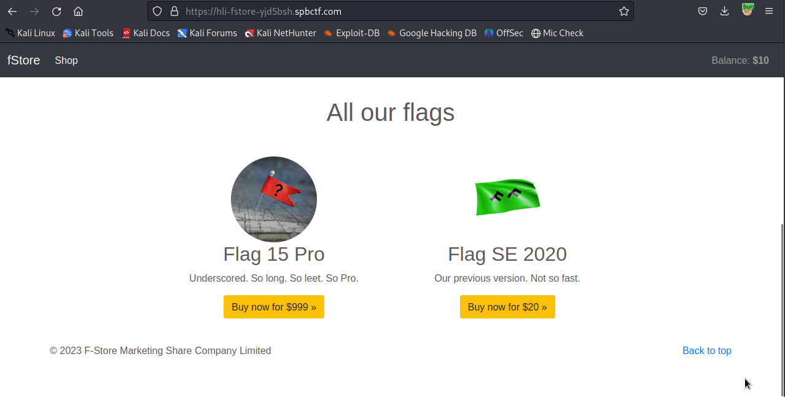
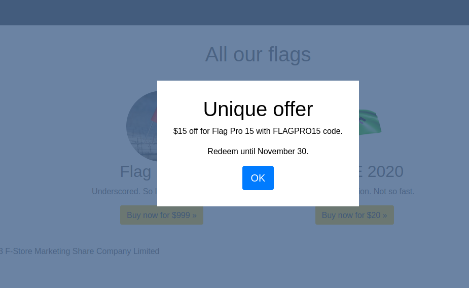
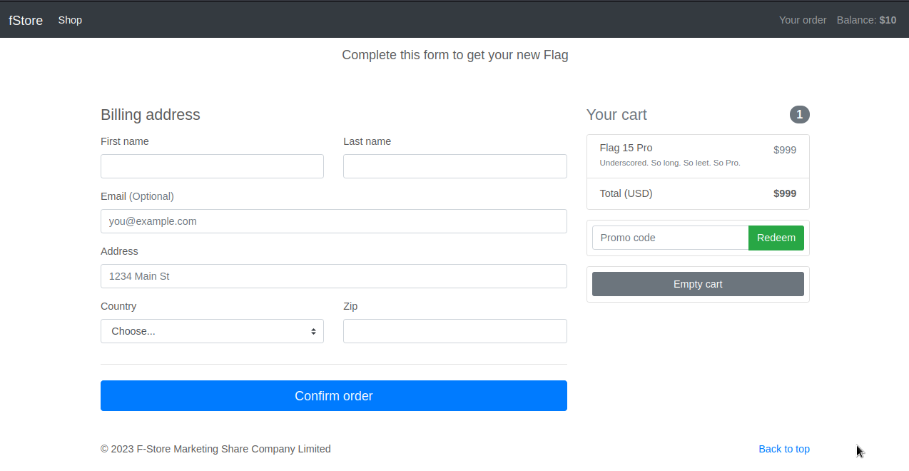
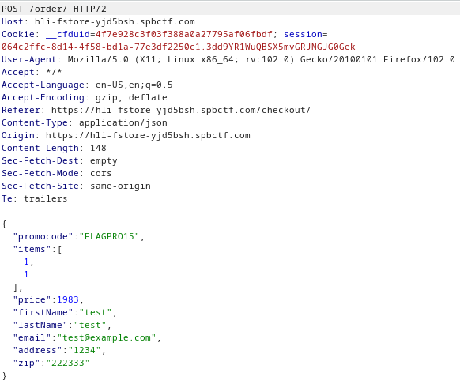
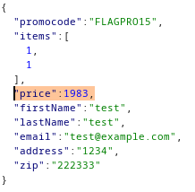
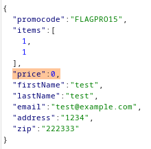
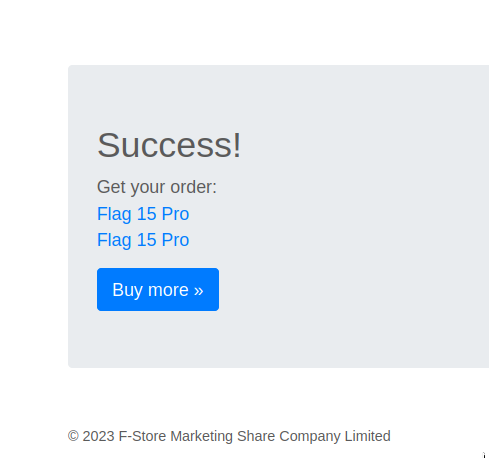
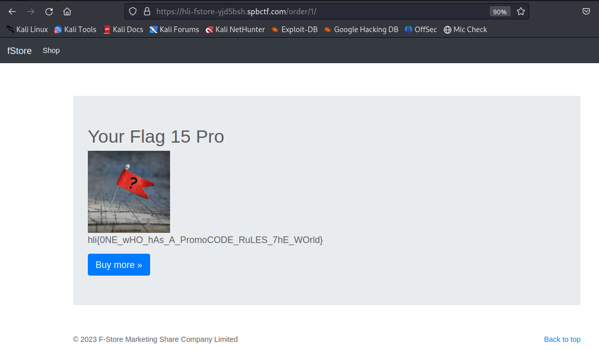

# Challenge 2 - fstore:Upgrade
- Solved by: @Elma, @BaeSenseii
- Flag: hli{0NE_wHO_hAs_A_PromoCODE_RuLES_7hE_WOrld}

## Screenshot of Challenge

## Writeup
Visiting the provided weblink within the challenge redirects us to some ecommerce website that requires players to buy the Flag 15 Pro in order to get the flag:

So what we need to do first is to explore the entire shopping cart checkout process. We proceeded to add the Flag 15 Pro into the shopping cart and proceeded to fill up our billing details:

Upon checkout, we noticed that there was a HTTP request sent out that consists of details of the entire cart, INCLUDING the total price:

Since we were already proxying the traffic via Burp, it wasn't that difficult for us to tamper the price value to 0.0, and whaddya know? IT WENT THROUGH:

 

All we needed to do is just to click on the link to the Flag 15 Pro to get our flag:

