# Challenge 3 - Nmapaas-Easy
- Solved by: @Elma, @BaeSenseii
- Flag: hli{nOw_Y0U_Know_real_nAME_OF_NmAp_4dmin}

## Screenshot of Challenge
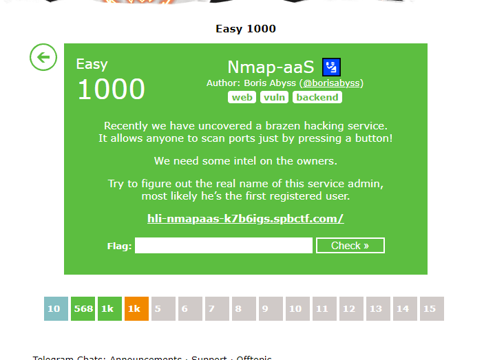

## Writeup
Once website is loaded, you're presented with a login screen (standard username and password stuff). There's also a registration function available, so first thing to do is to get meself a valid user account.

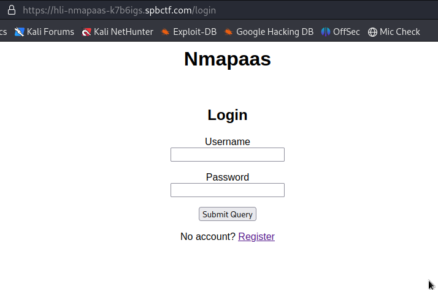

The registration process wasn't that complicated as it only involves checking if the username is valid. Once registered, attempt to log into the website was made and we were presented with a QR code to configure for 2FA TOTP.

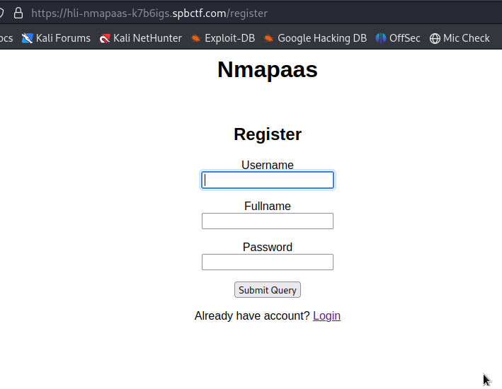
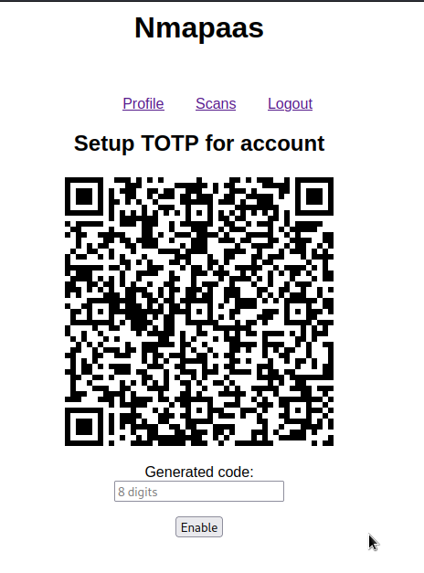

Once configured, we could start creating new scans as if you were running the nmap service. To avoid any network connectivity delays, go to scans and type the IP address 127.0.0.1. A scan history will be created to view the results.

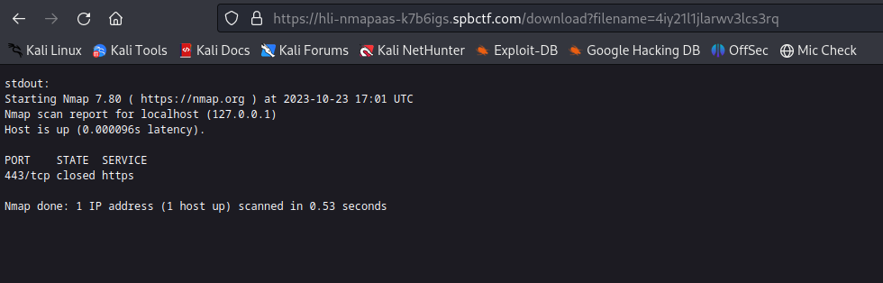

Notice that access to any scan history involves the variation of the 'filename' HTTP GET parameter. Could this be vulnerable to Local File Intrusion / Path Traversal? HMMMM..

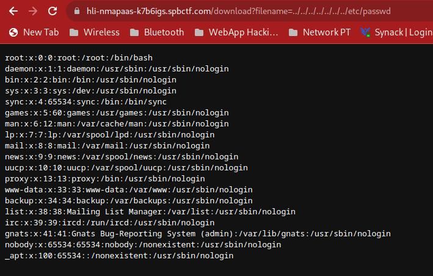

Well whaddya know? It does work :D So we started finding a list of possible files that are important to look at: (https://github.com/swisskyrepo/PayloadsAllTheThings/blob/master/Directory%20Traversal/README.md), and we found this in /proc/self/environ:

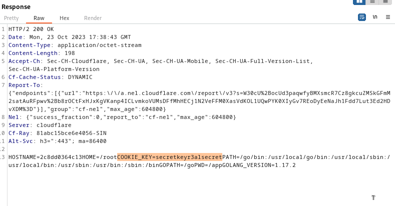

At first we had no clue as to what it was when we saw the COOKIE_KEY parameter, till we realised that all authenticated sessions are using JSON Web Tokens -_-" If you're not sure what JWT is, i suggest you do a quick readup on how it works: https://jwt.io/introduction

In short, if we were to tamper any portion of the JWT, there has to be a corresponding signature that matches the JWT body (for data integrity / validation purposes). In order for web servers to create the JWT, you must create a secret key that is ONLY known to the server (but in this case, we already did.)

We copied a sample JWT cookie from one of our authenticated requests and we specified the COOKIE_KEY value that we found earlier, and it turns out to be a match based on the inputs we keyed in https://jwt.io:

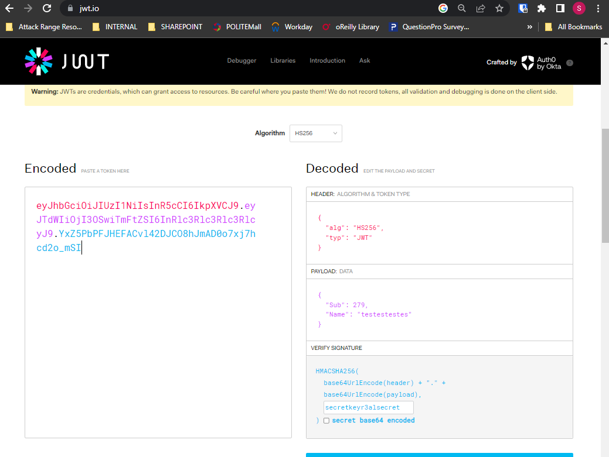

So this means we can safely create a VALID JWT token even after tampering the JWT body. We set the 'Sub' variable to 1 as we suspect that the web server verifies your authorization of resources based on that value.

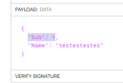

To use it, we just need to fire up the Firefox Debugging Console and type in the following:

```
document.cookie = <whatever NEW JWT token you have created earlier>
```

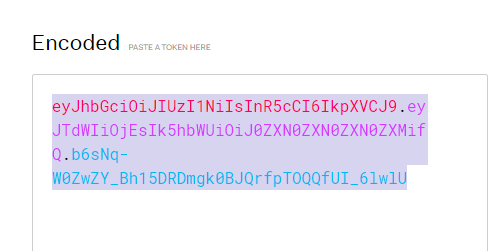
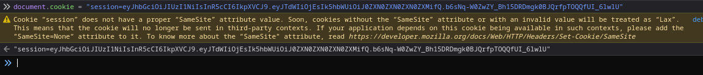

Proceed to the Profile section and voila, the flag is shown :).

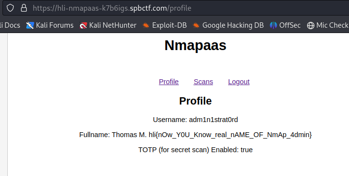