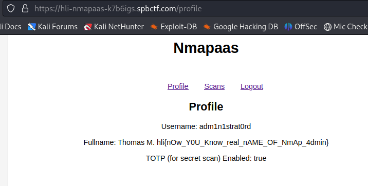

# Challenge 4 - Nmapaas-Hard
- Solved by: @Elma, @BaeSenseii
- Flag: hli{y0U_aR3_re4L_HaCKeR_ToTP_NO7_A_pRoBLem_foR_you}

## Screenshot of Challenge


## Writeup

Based on the challenge description, we are to access the first scan made by the user, however the following error was displayed:


Seems that the scan was configured to be made 'private', which means that a TOTP device will have to be present. But the weird thing is that it is not possible for us as the totp configuration for the user is deemed to be missing.

When a TOTP is configured for a user account, a configuration file will be created inside the /var/lib/nmap-saas/totp-secrets folder. You can see your own totp-secrets configuration by using the LFI vulnerability found earlier (this is for our test user 'wotwotwot'):

```
otpauth://totp/nmap-saas:wotwotwot?algorithm=SHA1&digits=8&issuer=nmap-saas&period=30&secret=PCIAFTW2XTYM4HGXLGVCMV7UIO7SGTL5
```

Both Elma and I got stuck on this challenge for quite a while, but it was a hilarious convo that we had when we found out the error (here's a snippet):


Let's look back again at the last screenshot of nmapaas-easy:



See the freaking username above? If you look at our first screenshot we got something like this:

```
controller error: open /var/lib/nmap-saas/totp-secrets/admin
```

It turns out that it was because of our JWT token that we generated to use was this:


The "Name" field of the JWT token was referenced to access the 'totp-secrets' of the user. Basedd on the profile username in Challenge 3, the username given is 'adm1n1strat0rd', which means that now we need to create the JWT token with that username.

Once you log in, the webapp will ask you to key in a valid TOTP value. In this case, we can actually generate the TOTP value by extracting the configurations:


We used a website that can generate the TOTP value based on the configuration settings provided:


After that you should be able to access the scan now:

