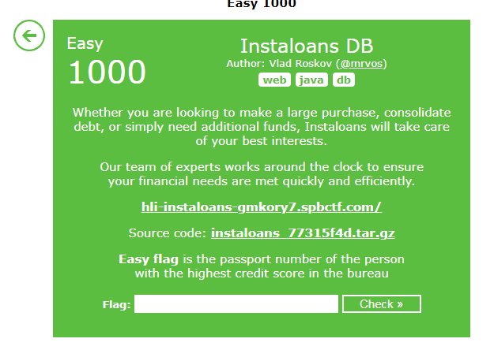

# Challenge 5 - Instaloans DB
- Solved by: @Elma, @BaeSenseii
- Flag: hli{3aSy_t0_ExpLo1T_aN_5qLi_wH3n_y0u_h4V3_a_L0caL_C0pY}

## Screenshot of Challenge


## Writeup
Given source code and the URL to the actual website, the functionality of the app is as follows:
- User registers an account (requires personal details such as first/last name, birthdate, passport number, etc)
- Once successful, log in with the newly-created credentials. 
- Only function available is the user can view his/her credit score (because bank got no money lol)


Based on the provided source code (which included the docker deployment configurations), we can say about the following folders:
- loans => main app logic website (powered by Flask)
- bki => backend bank processing site for transactions (powered by Spring Boot)
- bki-db => main database that stores all bank-related information of users (powered by PostgreSQL)

```
version: '2.4'

services:
    loans:
        build: loans
        ports:
            - "5000:5000"
        stop_grace_period: 0s

    bki:
        build: bki
        environment:
            SPRING_DATASOURCE_URL: jdbc:postgresql://bki-db:5432/creditscore
            SPRING_DATASOURCE_USERNAME: creditscore
            SPRING_DATASOURCE_PASSWORD: creditscore
        stop_grace_period: 0s

    bki-db:
        image: postgres:9.5
        environment:
            POSTGRES_DB: creditscore
            POSTGRES_USER: creditscore
            POSTGRES_PASSWORD: creditscore

```
Since the challenge mentioned the word ‘DB’, the first thought that comes to my mind is that maybe it has to do something with SQL Injection. Based on the source code, we managed to find a possible SQL Injection vector here (./instaloans/bki/src/main/java/com/bki/creditscore/controller/CreditScoreController.java):


Even if we can do SQL injection, there has to be a way to display out the data that we have injected into the query. Based on the SQL statement above, it seems the best way to do so is to use the UNION query. As a rough guide, this is what we hoped to inject (highlighted in red text):


The red text signifies the data that we need to submit to the ‘passport’ field when registering for a new account. Since all of our web traffic has already been proxied using Burp, it is not that difficult to just create a new account by sending the ‘register’ request to Burp Repeater/Proxy and editing the necessary fields. A point to take note that since the injected data has spaces and special characters, it would be safer to URL encode it (which you can easily use Burp Decoder > encode to URL).


Once done, log in with the user credentials and check the credit score. Voila! You got your flag yoz  🙂

