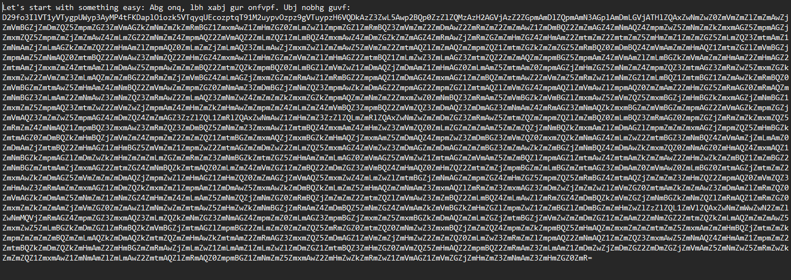
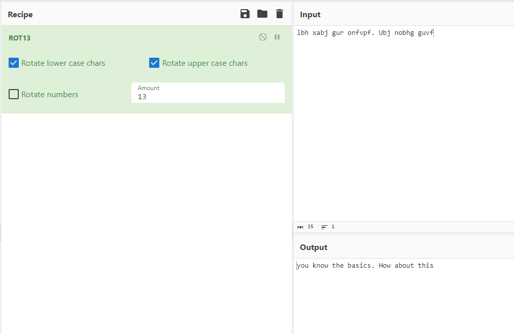
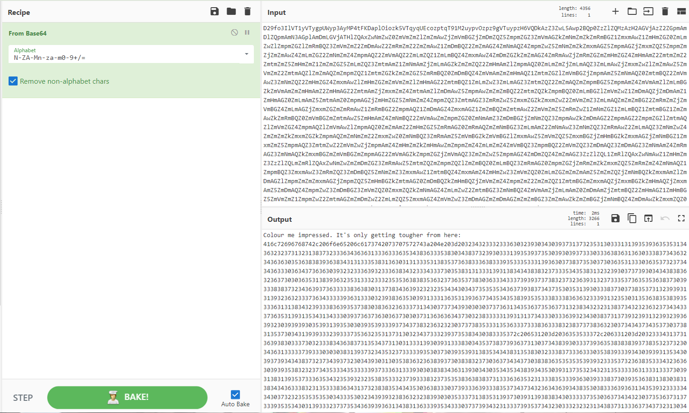
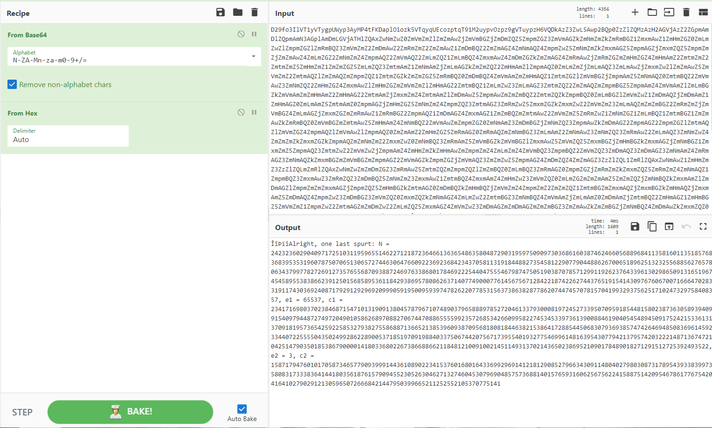
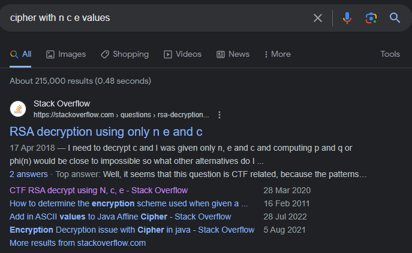
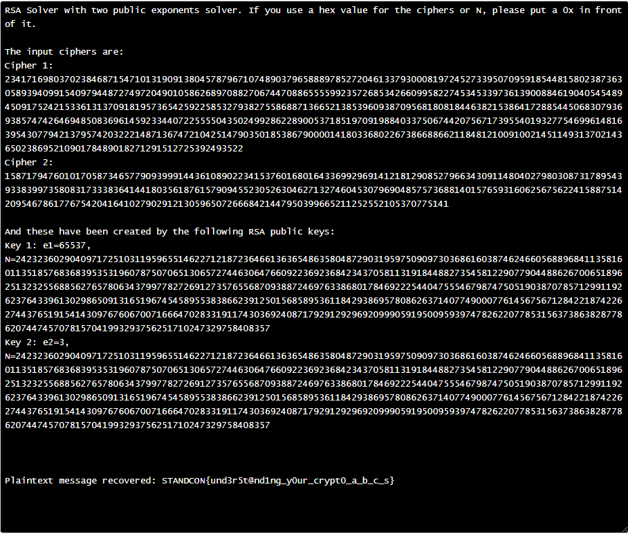

# Crypto - BabyCrypto
- Solved by: @Kurasama
- Flag: STANDCON{und3r5t@nd1ng_y0ur_crypt0_a_b_c_s}

## Writeup
We are presented with output.txt to decipher

From looks of it, there seems to be 2 ciphers ongoing at the same time

From the 1st string, it was encoded with rot-13 (looked relatively famaliar tbh from one of my labs in EHIP)

As for the other, it was first encoded with Base64, which was also suggested by the tool itself

"Colour me impressed" seems to suggest hex, so we shall try that

Initially I was not sure what i was looking at, so I did a quick search with the given key values

Now that we know this is a RSA encrypted message, I managed to find an online decoder for it, and thus attaining the flag

