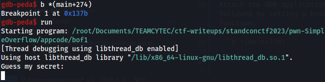

# Pwn - SimpleOverflow
- Solved by: @BaeSenseii (assisted by @Elma)
- Flag: **-UNKNOWN-** (Apologies, lost the flag as there were no screenshots :()

## Writeup
Basically for any pwn challenge, the actual binary is always provided to the participant. First thing i did was just to run it and this is what i got:


First thing to do is to pump it into Ghidra, and based on the decompiled code we can derive the following:
- The 'secret' input that the user needs to key in is located in the memory address of '_s2 + 0x10'.
- An integer pointer located at '_s2 + 0x20' has to point to a value of 0x1 in order to view the flag.


Attach the GDB application to the binary, followed by setting a breakpoint at the gets() function:

```b *(main+274)```



If we look closely, the 'if' condition stated in the disassembled code is represented with this assembly instruction:

```0x55555555539c <main+307>:	cmp    eax,0x1```

 We try to figure out what can we overwrite with our user input. What i do know is that after doing some trial and error, around 200000 bytes of random data causes a segmentation fault on the binary app:


Create a pattern offset of 200000 bytes using GDB PEDA and copy it as part of the user input to key in the secret (re-run GDB again):


Notice that the RAX register which is used for the 'if' condition is overwritten with our data:


Copy the value listed in RAX and paste it inside PEDA to calculate the offset (and you'll notice that it's 16):

```pattern search AACA```


This means that anything after the 16 bytes will be inside the RAX register. Since we only need the RAX register to be equal to 1 (or 0x1), we simply need to run this command to test it locally within our system:

```python3 -c "print('A'*16+'\x01')" | ./bof1```


Since the challenge was hosted remotely, all you need to do is to type in the following command instead:

```python3 -c "print('A'*16+'\x01')" | nc url_to_simpleoverflow_chall```

Gotta give a huge shoutout to @Elma here for guiding me. NGL, it does feel kinda good to be able to solve pwn challenges. :)
