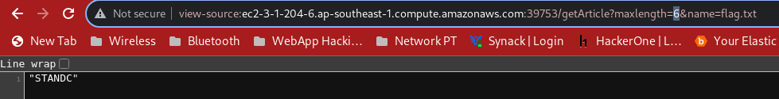

# Web - Ye Olde News Website
- Solved by: @BaeSenseii
- Flag: STANDCON{Y3_0LD3_S1MPL3_FL4G}

## Writeup
If you look at the website, you'd probably see something like this (looks like a simple webpage with some old English font):


First thing to do is to click on the links, and when we click on '3. secret', we will see something like this:


Notice that for the highlighted text, the text seems like it was cut off. Doing a quick inspect on the website resulted in this:


It turns out there is a maxLength variable (within the JavaScript code) that cuts down the number of words that can be displayed for the article (which is dictated in the 'article' HTTP parameter):


If we also look closer in the JavaScript code, there's also a 'cateogry' HTTP parameter, which serves like a folder. We access the folder by placing the following URL:

```http://ec2-3-1-204-6.ap-southeast-1.compute.amazonaws.com:39753/dir?category=.```


From there, we can see that there is a flag.txt article. We attempted to access it by using the following URL:

```http://ec2-3-1-204-6.ap-southeast-1.compute.amazonaws.com:39753/getArticle?maxLength=10000&name=flag.txt```


There is some form of access control mechanism that does not allow us to see the flag. HOWEVER, when we adjust the maxLength to a small value, for example 6:



We could see a portion of the flag header. After tinkering with the maxLength variable back and forth, we can conclude that the access control mechanism only kicks in IF the word "STANDCON" is part of the output (amounts to maxLength=8):


As for the hash value (which is a MD5 hash), it turns out that the hash is generated based on the text value displayed BASED on the maxLength value. If we take note the hash value in the image above, the output is the same as this Linux command with md5hash:


So what we do know is this:
- MaxLength variable controls the text output.
- The hash value displayed on the webpage is a MD5 hash value of the text output.

A quick Python solving script was made (you can refer to the solve.py script in this repo):
```python
#!/usr/bin/python3

import hashlib,requests

MAXLENGTH=30

chars = "ABCDEFGHIJKLMNOPQRSTUVWYZabcdefghijklmnopqrstuvwxyz1234567890-=[]\;',./!@#$%^&*()_+{}|:\"<>?"
flag = "STANDCON"

for i in range(8,MAXLENGTH+1):

	# fetch the hash from the website
	url = "http://ec2-3-1-204-6.ap-southeast-1.compute.amazonaws.com:39753/getArticle?maxlength="+str(i)+"&name=flag.txt"
	r = requests.get(url)

	res = (str(r.text).split(' '))[6]
	hash = res[0:len(res)-1]

	temp = flag

	for el in chars:
		temp = temp + el
		h_check = hashlib.md5(temp.encode()).hexdigest()
		if h_check == hash:
			flag = flag + el
			break
		else:
			temp = flag

print(flag)
```

What this script does is pretty simple:
- Adjust the maxLength HTTP parameter before sending it to the website (starting with maxLength=8, and all the way to 30)
- Obtain the hash value from the website.
- Append a character, to the partial flag that we have crafted and generate a hash with the partial flag.
- If the partial flag hash matches the one retrieved from the Internet, increase the maxLength by 1 and add it as part of the partial flag.
- Repeat this process until maxLength hits 30.

You should be able to see the final flag that looks like this:

